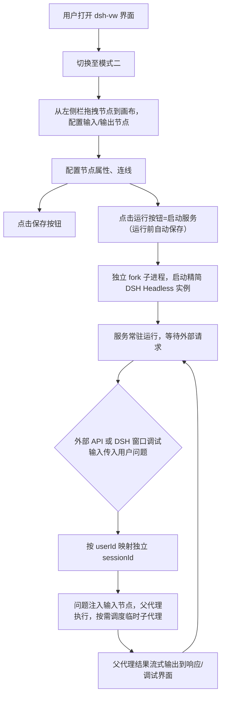

# dsh visual workflow 需求文档（PRD）

**文档编号**：PRD-001
**当前版本**：v0.1.0（定稿）
**修订日期**：2026-08-23

## 修订记录

| 版本 | 日期 | 修订说明 |
|------|------|----------|
| v0.1.0 | 2026-08-23 | 初稿 → 定稿：落实需求澄清问卷结论（Q01–Q25，含用户修订项 Q06/Q16/Q19）；补充双模式运行语义、断点续跑、运行中双向同步、模式二 REST API 规范、数据存储规划；工具精简（5 工具+可见性/可选注入）；新增「复用与差异清单」（旧项目 → 新项目）；补充提示词工程规范（架构文档 §13） |

---

## 1. 产品背景

dsh visual workflow 是 DeepSeek Harness 生态中的可视化多 Agent 工作流设计器插件。

### 产品定位

产品分为双模式，定位各不相同：

**模式一（编排执行模式）：面向复杂长流程的智能多 Agent 协同调度引擎**

> 作为 DSH 的**流程中枢与决策大脑**，专为解决"高复杂度、长周期、多步骤"的智能化任务编排而设计。它并非简单的线性自动化脚本工具，而是一个具备**自主监督、动态调度与状态保持**能力的智能编排系统。

**模式二（后台服务模式）：面向高频轻量请求的知识库问答后台服务引擎**

> 面向企业级知识库问答的轻量化服务引擎。零代码配置，一键部署为独立 API 服务，支持多租户隔离与流式交互，可接入自建平台或飞书、企微等第三方平台。

> 说明：本期仅交付标准 REST API（OpenAI 兼容协议），飞书/企微等第三方平台通过该协议接入，平台适配器属于后续扩展点（见 §4.1.3 与开放问题清单）。

## 2. 术语与缩写定义

| 术语/缩写 | 全称 | 定义说明 |
|-----------|------|----------|
| dsh | DeepSeek Harness | 底层 Agent 运行框架，提供父子代理调度能力 |
| dsh-vw | dsh visual workflow | 本项目名称，可视化工作流设计器插件 |
| 模式 | Mode | 该插件存在两种模式，通过右上角按钮切换，服务于不同的目标用户 |
| 父代理 | Parent Agent | 模式一：工作流的调度者（不执行具体任务）；模式二：流程主要执行者与最终回答者。以下简称"父" |
| 子代理 | Child Agent | 任务执行者，由父代理调度，完成具体子任务 |
| 节点 | Node | 画布中的各个节点，通过线段连接，分为多种类型 |
| 虚拟节点 | Proxy Node | 主节点的别名引用，用于拓扑复用，不存储独立配置 |
| 连接点 | Point | 物理意义上两个点连接的端点，分为多种类型；区别于宏观的"节点" |
| 上下文 | Context | 节点间传递的文本内容、文件索引、服务标识等信息 |
| 连线 | Line | 连接两个节点之间的有向线段，用于控制流程的进行方向和上下文的注入，分为多种类型 |
| 上游产出 | Upstream Output | 上游节点执行完成后的最终输出内容（子代理汇报的结论/产物摘要或完整文本） |
| 断点 | Checkpoint | 流程暂停/中断时持久化的执行进度（已完成节点产出、待执行节点清单等） |
| 续跑 / 恢复 | Resume | 从断点继续执行，已完成的节点不重复执行 |
| 双向同步 | Bidirectional Sync | ① 用户修改画布并保存后，运行中的编排实时感知（后续调度读取最新工作流快照）；② 编排运行状态（节点执行状态、高亮、输出摘要）实时回显到画布 |
| preset | Agent Preset | 官方 Agent 预设模式（如标准/极简/ptc 等），决定代理可用的官方工具集合 |
| 工具组合 | Tool Combo | 用户自定义的工具勾选清单（可含 MCP 服务器），id 以 `combo-` 前缀标识 |
| 服务 | Service | 模式二中的一个后台服务实例（一个服务 = 一个模式二工作流 + 一个常驻子进程 + 一个 REST API 端口） |
| userId | 用户标识 | 模式二 API 请求方传入的租户标识，用于多用户会话隔离 |
| 插队发送 | Interrupt & Send | 在目标子代理当前回合执行过程中直接插入消息并即时响应（区别于排队发送） |
| ReAct 迭代 | React Iteration | 代理单回合内"思考-行动"循环的最大迭代次数；达到上限后**强制收尾**：子代理不再发起新的工具调用，并基于已有进展输出最终结论后正常结束（软截停，不硬性中断代理） |
| 回流重试 | Retry Limit | 单节点执行的重复尝试上限（超限后按护栏终止该节点） |

---

## 3. 核心流程

### 3.1 模式一：编排执行模式

```mermaid
graph TD
    A[用户打开 dsh-vw 界面] --> B[切换至模式一]
    B --> C[从左侧栏拖拽节点到画布，配置启动/结束等阶段节点]
    C --> D[配置节点属性、连线]
    D --> E[点击保存按钮]
    D --> F[点击运行按钮（运行前自动保存）]
    F --> G[父代理启动，按流程调度子代理]
    G --> H{是否到达暂停节点?}
    H -->|是| I[流程暂停，保存断点状态]
    H -->|否| J[所有节点执行完成]
    I --> K[用户点击运行，从断点继续]
    K --> G
    J --> L[父代理汇总结果，输出到界面]
    note over F,I: 运行中用户可修改画布并保存，保存后即时生效（双向同步）
```

### 3.2 模式二：后台服务模式



---

## 4. 功能需求

### 4.1 双模式架构模块

#### 4.1.1 模式切换功能

**需求描述**：

系统应在 UI 右上角"组合"按钮左侧提供"模式切换"按钮，点击弹出下拉菜单，可在"编排执行模式（模式一）"与"后台服务模式（模式二）"之间切换。

**业务规则**：

1. 每个工作流/服务文件独立标记所属模式，存储路径不同（模式一：`workflows/`，模式二：`services/`）。
2. 切换模式时不得影响当前正在运行的任何工作流或服务。
3. 两种模式共用相同的节点类型和连线逻辑，运行时进程隔离。
4. 默认启动时进入模式一。
5. 切换模式时若当前画布存在未保存修改，弹确认框：**保存并切换 / 放弃修改并切换 / 取消**（对应需求澄清 Q21）。

**验收标准**：

1. 点击切换按钮后，左侧栏列表、画布内容随模式切换更新：左侧栏显示对应模式的工作流/服务列表，画布区域重置为空白画布（未选中工作流状态）。
2. 模式一运行中的工作流在切换至模式二后继续运行，不被中断。
3. 模式二运行中的服务在切换至模式一后继续提供 API 响应。
4. 存在未保存修改时切换模式，按确认框选择的行为正确执行。

#### 4.1.2 模式一：编排执行模式

**需求描述**：

支持长流程的智能化编排任务，父代理作为监督调度者，子代理作为任务执行者，流程可断点续跑，运行期支持画布双向同步。

**业务规则**：

1. 点击"运行"按钮后，先自动保存当前画布，再启动完整编排流程；启动前校验工作流必须包含"启动"与"结束"节点（缺失时 Toast 提示"请先添加启动和结束节点"）。
2. 父代理不执行具体任务，仅负责调度子代理、判断流程走向；父代理节点可省略，省略时使用插件内置默认调度指令模板。
3. 子代理为延续性子代理，状态和上下文可保持（按 `sessionId:flowId:nodeId` 稳定复用；配置签名变化时重建并保留历史）。
4. 子代理的系统提示词、服务商、模型、思考强度等属性由用户自定义选择和填入，**不继承**父的提示词、记忆、模型、上下文等；工具继承父代理工具集，但通过白名单筛选（详见 §4.2.3）。
5. 子代理之间的上下文传递采用**显式连线**：如上游节点的"右一（上下文出）"连接点接入下游节点的"左一（上下文入）"连接点，则上游最终输出（上游产出）作为上下文传入下游；不连接则不传（旧项目"下游自行查阅上游交付物"的行为**不再保留**）。
6. 运行中允许修改画布并保存，保存后即时生效（每个节点执行前重读最新工作流快照，双向同步；见 §4.5 及其验收标准）。
7. 遇到暂停节点时，流程**到达暂停节点即暂停**（暂停节点为纯流程门，自身无任务、其右出不执行），保存断点进度到磁盘；再次点击"运行"时从暂停节点右出继续执行。
8. 关闭浏览器不影响流程运行，仅当关闭后端时才终止；后端意外关闭后，断点进度已持久化，重启后可手动从断点恢复（Q01：已执行节点不重跑，仅恢复其标记与产出摘要，未完成节点重新执行）。
9. 数据库内容绝不直接注入上下文，仅转换为向量检索/结构化查询工具供子代理调用（见 §4.2.4.2）。

**验收标准**：

1. 父代理能够正确调度所有子代理按流程顺序执行。
2. 上一节点执行完成后，正确传递给下游节点（存在 ctx 连线时注入上游产出）。
3. 暂停后点击运行，流程从断点继续，不重复执行已完成节点。
4. 意外关闭后端后，重启可手动从断点恢复流程，已 ok 节点不重跑。
5. 子代理的 System Prompt、模型等属性独立生效；工具白名单 ⊆ 父代理工具集。
6. 存在 ctx 连线时下游收到上游产出；不连线时不传递任何上游内容。

#### 4.1.3 模式二：后台服务模式

**需求描述**：

作为独立后端服务运行，通过 REST API（OpenAI 兼容协议）接收用户问题，流式输出回答，支持多用户会话隔离。

**业务规则**：

1. 点击"运行"按钮后，先自动保存当前画布，再独立 fork Node.js 子进程运行精简 DSH Headless 实例，暴露 REST API 端口；端口默认 **7860**，冲突时自动递增取空闲端口（Q10）。
2. 服务启动后常驻运行：关闭 Web 页面不释放资源，仅手动点击"停止服务"或关闭后端才终止。
3. 服务进程与主 DSH 进程完全隔离：子进程崩溃不影响主进程；崩溃后服务标记为 `crashed`，用户可手动重启。
4. 模式二画布中"父代理节点"为最终回答者（**唯一且必须**，Q13），子代理节点为临时代理，每次请求用完即清（执行完成即销毁，不延续）；模式二下父代理以**阻塞方式**调度：调用 `wf_run_node({ nodeId, wait: true })` 等待节点子代理执行完成后取回结果再继续（与模式一默认异步形成模式级差异，见 §4.4.2）。
5. 外部 API 传入的用户问题自动注入到"输入"节点作为初始上下文（无需连线；输入节点同时提供右出"上下文"连接点用于显式传递给下游）。
6. 流式输出内容为父代理的最终汇总结果，支持打字机效果渲染（SSE）。
7. 多用户隔离（Q09）：请求方必须提供 `userId`（body `user_id` 或 Header `X-User-Id` 二选一），插件按 userId 稳定映射独立 sessionId 并持久化映射关系；对话上下文完全隔离；未提供 userId 时返回 400。
8. 重启 DSH 时，若服务标记为"运行中"，自动恢复启动；恢复时端口被占用则按自动递增策略重新分配端口并更新状态（Q12）。
9. 第三方平台接入：本期仅交付标准 REST API（OpenAI 兼容），平台适配器（飞书/企微等）不在本期范围（Q11）。

**REST API 规范**（Q08 定稿）：

| 项目 | 约定 |
|------|------|
| 基础路径 | `POST /v1/chat/completions`（OpenAI 兼容）；`GET /v1/models` 返回服务信息（便于兼容客户端发现） |
| 鉴权 | 可选：配置 `apiKey` 后启用，请求须携带 `Authorization: Bearer <apiKey>`，否则 401；默认关闭（本机/内网） |
| 请求体 | OpenAI 兼容字段：`model`（可省略，忽略为工作流配置的父代理模型）、`messages`、`stream`；扩展字段：`user_id`（必填，或经 Header `X-User-Id` 传入） |
| 问题来源 | `messages` 中最后一条 `role=user` 的 content 文本作为问题内容 |
| 流式响应 | `stream=true` 时返回 SSE：`data: {"choices":[{"delta":{"content":"..."}}]}`，结束事件 `data: [DONE]` |
| 非流式 | `stream=false` 时返回完整 JSON（`choices[0].message.content` 为最终结果） |
| 错误 | 400（参数缺失，含缺少 userId）/ 401（API Key 错误）/ 404（服务不存在）/ 429（超过并发上限，默认 50，可配置） |
| 并发 | 单服务并发上限默认 50（可配置 `maxConcurrent`） |

**验收标准**：

1. 服务启动后，外部可通过 REST API 发送问题并接收流式响应（SSE）。
2. 不同 userId 的对话上下文完全隔离，互不干扰；持久化映射在服务重启后仍然有效。
3. 子代理执行完成后立即销毁，不占用内存资源。
4. 关闭浏览器后，API 服务仍可正常响应请求。
5. 重启后端后，运行中的服务自动恢复；端口冲突时自动重新分配。
6. 服务进程崩溃时主进程稳定运行，服务状态正确标记并支持手动重启。
7. 未提供 userId 的请求返回 400 及明确错误信息。

### 4.2 节点管理模块

#### 4.2.1 数据模型核心规则

**需求描述**：

确立"节点 JSON 即事实源"原则，模板仅作为复用壳，与节点实例完全解耦。

**业务规则**：

1. 左侧栏所有列表（除工作流列表外）均为模板列表。
2. 从左侧栏拖入模板到画布时，系统**深拷贝**一份模板数据嵌入工作流 JSON，此后与模板完全断开引用（节点数据为全量内联快照，不含 templateId 引用）。
3. 模板的后续修改不影响已生成的画布节点。
4. 画布节点为唯一事实源，节点的删除和更改互不影响（除虚拟节点级联删除之外）。
5. 工作流列表为实例列表，不存在"工作流模板"概念。

> 差异说明：旧项目采用 `templateId` 引用 + "编辑引用节点保存写模板 → 全节点同步"机制；新项目按本规则改为**深拷贝解耦**，旧引用同步逻辑（模板 usage 统计、inline 删除等）不再适用（见 §9 复用与差异清单）。

**验收标准**：

1. 修改左侧栏模板后，画布中已生成的对应节点内容不变。
2. 删除模板后，画布中对应节点仍可正常编辑、运行。
3. 画布节点的修改不会同步到左侧栏模板。

#### 4.2.2 工作流实例（定义中不属于节点，包含节点和连线）

**需求描述**：

定义完整的编排流程，关联画布中所有节点和连线。

**卡片设计**：

| 显示位置 | 字段 | 可编辑性 |
|----------|------|----------|
| 左侧栏 | 名称、描述 | 不可编辑（仅展示） |
| 右侧属性栏 | 名称、描述 | 可编辑 |
| 右侧属性栏底部 | 保存、删除按钮 | 删除按钮需二次确认 |

**业务规则**：

1. 点击工作流卡片后，画布显示该工作流的所有节点和连线。
2. 删除左侧栏工作流卡片时，级联删除画布中所有节点和连线，并删除对应工作流 JSON 文件（需二次确认弹窗）。
3. 工作流按会话隔离存储（`sessionId + flowId` 维度），模板全局共享（Q23）。
4. 点击"新建工作流"创建空白画布；新建与切换工作流时，若当前画布存在未保存修改，弹确认框（保存并继续 / 放弃修改 / 取消）。

**验收标准**：

1. 点击工作流卡片后，画布正确加载对应节点和连线。
2. 删除工作流卡片后，画布清空，对应 JSON 文件被删除，无垃圾文件残留。
3. 支持新增工作流（空白画布），工作流画布之间互不影响。

#### 4.2.3 角色节点

##### 4.2.3.1 父代理节点

**需求描述**：

定义父 Agent 的各项属性，是工作流的调度中枢与最终汇总者。每个工作流画布**最多有且仅有一个**父代理节点（模式一允许省略，省略时使用内置默认调度指令模板；模式二必须存在）。父代理的工具集定义了全局工具上限，子代理的工具白名单从此集合中筛选。

**卡片设计**：

| 显示位置 | 字段 | 可编辑性 | 备注 |
|----------|------|----------|------|
| 左侧栏 | 名称、System Prompt | 不可编辑 | System Prompt 超过 20 字时截断显示；父代理节点在"角色"Tab 的左侧栏置顶固定显示，不可拖拽排序 |
| 右侧属性栏 | 名称、System Prompt、服务商、模型、思考强度、模式（仅 preset）、高级选项（ReAct 迭代次数上限、回流重试次数上限） | 可编辑 | System Prompt 支持文本输入或从 .md 文件加载；父代理默认加载系统内置调度模板，可自由修改覆盖 |
| 右侧属性栏底部 | 保存、删除、复制按钮 | - | 复制按钮用于生成虚拟节点 |

**连接点定义**（从上至下）：

| 方向 | 连接点类型 | 语义说明 |
|------|------------|----------|
| 左入 | 数据库 | 连接知识库或结构化存储文件，通过向量检索/查询工具调用，不注入上下文 |
| 左入 | 上下文 | 接收上游节点传递的文本内容、文件索引等 |
| 左入 | 流程入 | 接收流程控制信号，触发节点执行 |
| 右出 | 上下文 | 将父代理最终汇总输出内容注入下游节点（非记忆注入） |
| 右出 | 流程出 | 发送流程控制信号，触发下游节点执行 |

**业务规则**：

1. 父代理的 System Prompt 默认为系统内置调度模板，用户可编辑修改覆盖（作为编排指令注入父代理，不会注入任何子代理内容）。
2. "思考强度"字段读取官方思考强度选择列表，影响父代理的推理深度；运行后不可更改。
3. 父代理模板不可删除（点击无属性显示），但画布中的父代理节点可删除；可创建其虚拟节点。
4. 父代理的工具集 = 其"模式（仅 preset）"解析出的工具清单（Q05）；子代理工具白名单 ⊆ 父代理工具集，不可超出。
5. 每个工作流画布最多有一个父代理节点，重复拖入弹出 Toast 提示并阻止操作。
6. 父代理的"高级选项"仅含 ReAct 迭代次数上限与回流重试次数上限（无输入/输出结构项）。

**验收标准**：

1. 父代理执行时，使用自身配置的 System Prompt（默认模板，可被用户覆盖），不包含任何子代理内容。
2. 各项自定义配置项能被正确注册、识别并运用。
3. 数据库连接点正确传递检索/查询工具，不直接注入数据库内容到上下文。

##### 4.2.3.2 子代理节点

**需求描述**：

定义子 Agent 的各项属性，是流程的核心执行单元。

**卡片设计**：

| 显示位置 | 字段 | 可编辑性 | 备注 |
|----------|------|----------|------|
| 左侧栏 | 名称、System Prompt | 不可编辑 | System Prompt 超过 20 字时截断显示 |
| 右侧属性栏 | 名称、System Prompt、服务商、模型、思考强度、模式（preset 和自定义组合）、高级选项（ReAct 迭代次数上限、回流重试次数上限、输入输出结构） | 可编辑 | System Prompt 支持文本输入或从 .md 文件加载 |
| 右侧属性栏底部 | 保存、删除、复制按钮 | - | 复制按钮用于生成虚拟节点 |

**连接点定义**（从上至下）：

| 方向 | 连接点类型 | 语义说明 |
|------|------------|----------|
| 左入 | 数据库 | 连接知识库或结构化存储文件，通过向量检索/查询工具调用，不注入上下文 |
| 左入 | 上下文 | 接收上游节点传递的文本内容、文件索引等 |
| 左入 | 流程入 | 接收流程控制信号，触发节点执行 |
| 右出 | 上下文 | 将代理最终输出内容注入下游节点（非记忆注入） |
| 右出 | 流程出 | 发送流程控制信号，触发下游节点执行 |

**业务规则**：

1. 子代理的 System Prompt 为空时，提示词即为空，不继承父代理提示词。
2. "思考强度"字段读取官方思考强度选择列表，影响子代理的推理深度。
3. "高级选项"中的 ReAct 迭代次数上限、回流重试上限、输入输出结构用于控制子代理的执行边界（输入/输出结构为模型理解描述占位，不做强校验，Q18）。其中 **ReAct 迭代次数上限采用软截停（强制收尾）语义**（V-01 定稿）：达到上限后子代理不再发起新的工具调用（工具调用被强制拒绝），并被要求基于已有进展输出最终结论后正常结束——不会硬性中断代理导致无产出；**回流重试上限**沿用旧项目节点级尝试计数护栏（超限视为节点失败）。
4. 点击"复制"按钮生成的虚拟节点，与主节点共享配置：修改主节点时所有虚拟节点实时同步更新（虚拟节点不存储独立配置）。
5. 删除主节点时如有其对应的虚拟节点存在，提前弹窗提示"该节点存在 N 个虚拟引用，删除后将级联清除"，确认后级联删除所有关联虚拟节点。
6. 连线检查：虚拟节点和主节点无法并行（同一执行代理不得同时处于运行中），且不得同时连入同一目标节点的同一连接点（防止重复触发）。
7. 虚拟节点（Q15）：运行时 `wf_run_node` 指向虚拟节点时解析为主节点 key，与主节点**共享同一子代理执行实例**与上下文。

**验收标准**：

1. 子代理执行时，仅使用自身配置的 System Prompt，不包含父代理内容。
2. 数据库连接点正确传递检索/查询工具，不直接注入数据库内容到上下文。
3. 虚拟节点右侧属性栏只显示主节点名称，不显示任何属性，无法对属性修改。
4. 删除主节点时，弹窗提示"该节点存在 N 个虚拟引用，删除后将级联清除"，确认后所有虚拟节点被删除。
5. 支持新增多个角色模板，模板之间互不影响。
6. 主节点与虚拟节点共享同一执行实例：任一正在运行时不得再次启动另一个。

#### 4.2.4 数据节点

定义子 Agent 的上下文获取与外部数据源接入，分为"文件"和"数据库"两个子模块。

##### 4.2.4.1 文件子模块

**卡片设计**：

| 显示位置 | 字段 | 可编辑性 |
|----------|------|----------|
| 左侧栏 | 名称、文件内容（文本类型）/文件名称（非文本类型） | 不可编辑 |
| 右侧属性栏 | 名称、文件类型（文本/文件）、文件内容（文本类型）/选择文件（非文本类型） | 可编辑 |
| 右侧属性栏底部 | 保存、删除按钮 | - |

**连接点定义**：

| 方向 | 连接点类型 | 语义说明 |
|------|------------|----------|
| 左入 | 无 | 文件节点为数据源，无上游输入 |
| 右出 | 上下文 | 文本类型：内容直接注入上下文；文件类型：仅注入文件路径索引 |

**业务规则**：

1. 文本类型：文件内容直接注入下游节点的上下文（注入上限默认 20000 字，超出截断并提示）。
2. 文件类型：**所有非文本文件（含图片、PDF 等全部类型）仅注入受管文件路径**，由子代理通过 DSH 自带读取工具自行读取（Q16；旧项目图片 base64 多模态直通逻辑**不再保留**）；非文本文件在"选择文件"时复制到插件受管目录（`data/files/`），避免源文件删除后失效。
3. 支持新增多个文件模板，模板之间互不影响。

**验收标准**：

1. 文本内容正确注入下游节点上下文。
2. 文件类型仅注入受管路径索引；子代理可通过读取工具读取文件内容（文件可支持所有类型，代理自行判断能否读取）。
3. 非文本文件不会以 base64/image block 直通模型上下文。

##### 4.2.4.2 数据库子模块

**卡片设计**：

| 显示位置 | 字段 | 可编辑性 |
|----------|------|----------|
| 左侧栏 | 名称、描述 | 不可编辑 |
| 右侧属性栏 | 名称、描述、类型（本地/服务器）、连接信息/选择本地文件 | 可编辑 |
| 右侧属性栏底部 | 保存、删除按钮 | - |

**连接点定义**：

| 方向 | 连接点类型 | 语义说明 |
|------|------------|----------|
| 左入 | 无 | 数据库节点为数据源，无上游输入 |
| 右出 | 数据库 | 注入数据库服务标识，自动转换为检索/查询工具提供给子代理 |

**业务规则**（Q17 定稿）：

1. 类型选择"本地"时，显示"选择文件"字段，支持选择 SQLite 等本地数据库文件；插件提供**内置向量检索**（文本分块 + 向量索引 + 相似度检索），子代理通过向量检索工具查询本地库内容。嵌入向量由插件内置 **bge-small-zh-v1.5 本地模型**（随插件分发的 ONNX 量化资产约 25MB，由本地 `models\backend\models\bge-small-zh-v1.5` 的 tokenizer/配置文件与转换后的权重组成，见架构文档 §6.5）在 CPU 上生成；模型资产缺失或加载失败时自动降级为 BM25 相似度检索（界面标注"相似度检索（非语义）"）；亦可配置外部 OpenAI 兼容嵌入端点（`embeddingEndpoint`）优先使用（Q-E 定稿）。
2. 类型选择"服务器"时，显示连接信息字段（数据库类型限定 MySQL / PostgreSQL、地址、端口、用户名、密码、库名），并在下方显示"测试连接"按钮；服务器类型提供 **结构化查询工具**（只读 SELECT 白名单约束）供子代理调用；服务器类型不提供向量检索。
3. 点击"测试连接"按钮，验证数据库可用性、连通性，返回成功/失败提示（Toast）。
4. 数据库内容**绝不直接注入上下文**，仅作为检索/查询工具供子代理调用。

**验收标准**：

1. 本地 SQLite：子代理可通过向量检索工具查询数据库内容，上下文不包含原始数据库数据。
2. 服务器类型（MySQL/PostgreSQL）：连接测试成功时 Toast 提示"连接成功"；子代理可通过结构化查询工具查询。
3. 数据库内容不进入上下文（无 base64/文本直通）。

#### 4.2.5 其他节点

定义各种非标节点，包含"阶段"和"协作组"两个子模块。**移除所有记忆节点相关逻辑**。后续支持新增更多节点类型。

##### 4.2.5.1 阶段节点

**卡片设计**：

| 节点类型 | 左侧栏显示 | 右侧属性栏 | 连接点 |
|----------|------------|------------|--------|
| 启动（模式一）/ 输入（模式二） | 名称（硬编码） | 不可编辑，无描述字段 | 无左入；右出：流程出、上下文（输入节点，模式二，用于传递外部问题） |
| 结束（模式一）/ 输出（模式二） | 名称（硬编码） | 不可编辑，无描述字段 | 左入：流程入（输出节点另有上下文入，用于汇聚父代理最终输出流式返回）；无右出 |
| 暂停（仅模式一） | 名称（硬编码） | 不可编辑，无描述字段 | 左入流程入，右出流程出 |

> 点击画布节点右侧属性栏底部显示删除按钮（没有保存按钮；此按钮删除的是画布节点）。点击左侧模板时，右侧属性栏无显示。
> "启动/输入"与"结束/输出"节点在画布中只能分别存在一个，再次拖入时弹出 Toast 提示；"暂停"节点可以有多个。

**业务规则**：

1. 阶段节点固定只有三张模板卡片，不可增删。
2. 模式二下，"启动"显示为"输入"，"结束"显示为"输出"，左侧栏不显示"暂停"节点。
3. 模式二"输入"节点必须接收外部输入参数（用户问题），自动注入初始上下文；输入节点的右出"上下文"连接点可将问题文本显式传递给下游节点。
4. 模式二"输出"节点接受父代理最终汇总内容并经服务 REST API 流式返回。
5. 模式一"暂停"节点：运行至此流程停止（流程门语义），保存断点进度；下次点击运行从断点继续。
6. 工作流必须包含"启动/输入"和"结束/输出"节点，否则不允许运行（Toast 提示"请先添加启动和结束节点"）。

**验收标准**：

1. 模式切换时，阶段节点模板名称自动更新（启动↔输入，结束↔输出）。
2. 模式二下，左侧栏不显示"暂停"节点。
3. 缺少启动/结束节点时，点击运行弹出 Toast 提示"请先添加启动和结束节点"。

##### 4.2.5.2 协作组节点

**卡片设计**：

| 显示位置 | 字段 | 可编辑性 |
|----------|------|----------|
| 左侧栏 | 名称、组合成员 | 不可编辑 |
| 右侧属性栏 | 名称、组合成员、协作 Prompt | 可编辑 |
| 右侧属性栏底部 | 保存、删除按钮 | - |

> 此处需要区分点击区域：精准点击协作组内部成员卡片时，右侧显示对应角色节点属性；点击协作组卡片空白区域时，右侧显示协作组属性。

**连接点定义**：

| 方向 | 连接点类型 | 语义说明 |
|------|------------|----------|
| 左入 | 流程入 | 接收上游流程控制信号，触发组内所有角色并行执行 |
| 右出 | 流程出 | 组内所有角色执行完成后，发送流程控制信号到下游 |

**业务规则**：

1. 将角色节点拖入协作组后，形成协作组合，支持拖入多个角色。
2. 协作 Prompt 追加注入到组内所有成员的 System Prompt 末尾，支持文本输入或从 .md 文件加载。
3. 组内所有角色节点**并行启动**，非串行。
4. 组内角色节点仅有上下文连接点（左入：数据库/上下文；右出：上下文）+ 组卡片提供的流程入/出；上下文连接点语义与普通角色节点完全一致，**允许跨组边界连线**（Q07：组内成员节点的左入/右出可连接组外节点，连线规则不变）。
5. 组内 Agent 通过 `wf_ask_agent` 工具进行阻塞式通信（协议见 §4.4.1）。
6. 组内所有角色执行完毕后，协作组视为完成，流程从组卡片右出继续。
7. 一个工作流内可有多个协作组，通过 ID 区分。
8. 卡片边界悬停显示拉伸按钮，上下左右均可拉伸。
9. 组内角色卡片缩小显示，仅展示名称和状态字段，形成可滚动列表。

**验收标准**：

1. 拖入协作组后，组内角色并行启动执行。
2. 协作 Prompt 正确追加到每个角色的 System Prompt 中。
3. 组内 Agent 可通过 `wf_ask_agent` 互相通信，阻塞等待回复。
4. 所有角色执行完成后，流程正确传递到下游节点。
5. 拉伸协作组卡片时，内部角色列表可正常滚动。
6. 组内成员节点可与组外节点正常连线（上下文/数据库）。

### 4.3 连线管理模块

**需求描述**：

定义节点间的连接关系，支持流程控制、上下文传递、条件判断等功能。

**属性设计**：

| 显示位置 | 字段 | 可编辑性 |
|----------|------|----------|
| 右侧属性栏 | 连线类型（流程/通过/不通过/内容）、内容值（选择"内容"时显示） | 可编辑 |
| 右侧属性栏底部 | 保存、删除按钮 | - |

**连线类型与颜色规范**：

| 连线类型 | 语义说明 | 颜色 | 色值（深色/浅色模式自适应） |
|----------|----------|------|------|
| 流程连线 | 控制执行顺序 | **冷灰 / 银白** | `var(--wf-flow, #8E9AAF)` |
| 上下文连线 | 传递文本内容、文件索引 | **琥珀金** | `var(--wf-context, #F5A623)` |
| 数据库连线 | 传递数据库服务标识 | **天蓝** | `var(--wf-database, #4A9FF5)` |
| 条件：通过 | 条件判断为真，执行该分支 | **翠绿** | `var(--wf-pass, #3BC14A)` |
| 条件：不通过 | 条件判断为假，执行该分支或回流 | **珊瑚红** | `var(--wf-fail, #E85C5C)` |
| 条件：内容 | 自定义语义判断（如路由标签） | **紫罗兰** | `var(--wf-content, #B47CF5)` |

> 编辑条件后，条件颜色覆盖初始颜色；条件判断由父代理进行语义判断。

**业务规则**：

1. 每条流程连线的默认类型为"流程"（无判定）；在属性栏切换为"通过/不通过/内容"后升级为条件连线（标签与颜色随之更新）。
2. 选择"内容"类型时，下方显示输入框，可自定义输入字段（如路由标签）。
3. "内容"条件判定（Q03）：把上游节点产出摘要 + 各分支的"内容"标签注入父代理，由父代理**语义判断**走哪条分支。
4. 条件连线（通过/不通过/内容）仅支持"流程出 → 流程入"类型；上下文/数据库连线无条件（Q04）。
5. 连线颜色根据类型自动渲染，不可手动修改。
6. 所有连线均支持选中后在右侧属性栏进行"保存"和"删除"操作。
7. 删除连线时，自动清理关联的节点连接关系。

**验收标准**：

1. 不同类型连线颜色正确渲染。
2. 选择"内容"类型后，输入框正确显示，可输入自定义字段。
3. 删除连线后，节点连接点恢复为未连接状态。
4. 条件连线正确注入父代理语义判断上下文；父代理按上游产出与标签选择分支。

### 4.4 工具扩展模块

#### 4.4.1 wf_ask_agent 工具（新增）

**需求描述**：

新增 `wf_ask_agent` 工具，支持 Agent 间阻塞式通信。

**业务规则**：

1. 参数三态（单工具协议）：`wf_ask_agent({ cmd: "ask" | "reply" | "resolve", targetChildId, message?, askId? })`——`ask` 发起问题（调用方挂起等待）；`reply` 由目标代理回复（携带 askId）；`resolve` 由父代理执行超时裁决（action: `continue`/`resend`/`abort`，携带 message：`continue`=延长等待、`resend`=重新投递、`abort`=以超时错误结束调用方挂起）。
2. 调用方挂起等待，Host 唤醒目标 Agent 并派发消息（`ask` 对 `targetChildId`；`reply` 对发起方）。
3. 该工具发送的消息采用**插队发送**逻辑（V-03 定稿）：以官方底层 `Agent.steer()`（next-step 唤醒，即官方 report 投递同款原语）投递，目标 Agent 正在执行任务过程中也能在其下一个步骤边界收到并及时响应；目标子代理不在内存（冷态）时回退官方 `subagents.followup`（自动冷恢复）。
4. 目标 Agent 回复后，解除调用方阻塞并返回结果（`reply` 携带 askId 定向回复）。
5. 工具**可选注入**：默认不加入子代理工具白名单；需要时在组合管理中勾选（tool 目录可见）。协作组 Prompt 会强调该工具的重要性（但协作组成员可按需不勾选，此时组内通信不可用，仅保存/运行时给出提示）。
6. 系统增加超时机制（默认 2 分钟，可配置），防止互相调用导致死锁。
7. 触发超时时：将超时异常结果和子代理的工具请求内容（含工具请求参数与目标代理 ID）注入父代理，**被阻塞子代理停止执行等待父代理裁决**；父代理通过 `ask_user_question` 向用户征询后裁决（Q06：继续等待/重发消息/终止目标代理），并经 **`wf_ask_agent(cmd: "resolve")`** 把裁决结果投递给被阻塞子代理（继续执行/恢复任务）。
8. 主代理发现事件不可控，必须及时叫停工作流（写入父代理 Prompt）。
9. 工具调用日志正确记录通信内容。

**验收标准**：

1. Agent A 调用 `wf_ask_agent` 向 Agent B 提问，Agent B 回复后，A 正确接收结果。
2. 超过超时时间未回复，返回超时错误；异常结果与请求信息正确注入父代理；父代理向用户征询后下达裁决，被阻塞子代理按裁决继续执行或终止。
3. 工具调用日志正确记录通信内容。

#### 4.4.2 wf_ask / wf_run_node / wf_finish 工具

> 原项目已有完整实现，直接复制所有逻辑和样式（已验证：`lib/wf-tools.js` + `lib/orchestrator.js` + `lib/agent-runner.js`）。
> `wf_run_node` 需新增扩展：① 启动子代理时传入节点级自定义参数（思考强度、ReAct 迭代次数上限、回流重试上限等）；② `wait` 阻塞/异步选择；③ 暂停节点语义（原 `wf_pause` 并入）。

**业务规则**：

1. `wf_run_node({ nodeId, wait? })`：启动节点子代理。**默认异步**（模式一）：立即返回 `{ nodeId, status: "started", childId }`；**`wait: true` 时阻塞**（模式二）：等待该节点子代理执行完成，返回 `{ nodeId, status: "ok" | "fail", childId, output }`（阻塞期间受运行停止/回调信号中止控制；完成事件与 `subagent/end` 观察共用同一通道）。
2. `wf_run_node` 扩展参数：`{ thinking?, iterationLimit?, retryLimit? }` 等节点级参数（继承节点配置，可覆盖；思考强度取值域以官方为准，阶段 3 已验证）。
3. **暂停节点语义**：`wf_run_node({ nodeId: <暂停节点 id> })`——编排器识别 pause 节点即把 run 置为 `paused` 并持久化断点（resumeFrom=暂停节点右出），返回 `{ nodeId, status: "paused" }`；运行锁保留；再次点击运行时从断点继续（详见 §4.7）。不再单独设 `wf_pause` 工具（工具精简）。
4. `wf_ask(questions[])`：子代理向主会话用户提问（官方提问卡呈现、一次多问），旧项目逻辑完整复制；**可选注入**：默认不加入子代理工具白名单，需要时在组合管理中勾选。
5. `wf_finish(status?, summary?)`：父代理收尾信号（completed/failed），幂等，释放运行锁；旧项目逻辑完整复制。
6. 护栏：全局调用上限（500 次）、单节点重试上限、空闲超时（30 分钟，可配置）、父代理出错自动标记失败——全部沿用旧项目。
7. **工具可见性**（上下文精简）：`wf_run_node`/`wf_finish` 仅父代理可见（子代理 scope 经官方 `tools.restrict` 隐藏）；`wf_ask`/`wf_ask_agent`/`wf_db_query` 默认不注入任何代理，仅当组合/白名单勾选或存在数据库连线（db-in）时按需进入对应子代理工具集；父代理可见 `wf_run_node`/`wf_finish`/`wf_ask_agent(resolve)` 及有连线时的 `wf_db_query`。

**验收标准**：

1. 三个核心工具行为与旧项目一致（回归）。
2. `wf_run_node` 的新增参数正确透传到子代理启动配置（思考强度生效、ReAct 上限生效）；`wait: true` 阻塞返回节点最终输出，`wait` 缺省异步返回 started。
3. 父代理对暂停节点调用 wf_run_node 后，run 状态为 paused、断点已持久化；续跑从断点继续且不重跑已 ok 节点。
4. 工具可见性符合 §4.4.2 规则 7（子代理上下文中不出现 wf_run_node/wf_finish；未勾选时不出现 wf_ask/wf_ask_agent；无数据库连线时不出现 wf_db_query）。

#### 4.4.3 数据库访问工具（wf_db_query，新增）

**需求描述**：

数据节点（数据库）的访问工具，单工具三模式，供代理按需调用。

**业务规则**：

1. 参数：`wf_db_query({ dataId, mode: "search" | "query" | "schema", query?/sql?, topK? })`（原向量检索/结构化查询/表结构三个工具**合并为单工具**，工具精简）。
2. `mode: "search"`：本地 SQLite 向量检索（内置 bge-small-zh-v1.5 嵌入，见 §4.2.4.2；不可用时降级 BM25 并在结果中标注）。
3. `mode: "query"`：结构化只读查询（仅 SELECT + 强制 LIMIT 白名单，拒绝写/DDL/多语句；本地与服务器数据库均支持）。
4. `mode: "schema"`：只读表结构查看。
5. 该工具**可选注入**：仅当对应子代理/父代理节点通过数据库连线（db-in）接入数据节点时，工具才会进入该代理的工具集（白名单自动解析）；无数据库连线的代理上下文中不出现。

**验收标准**：

1. 三种模式均可用且符合只读/检索约束；数据库内容不进入上下文，仅经工具查询结果返回。
2. 无数据库连线（db-in）的节点上下文不出现 wf_db_query。

### 4.5 UI 交互模块

**需求描述**：

定义画布、左侧栏、右侧属性栏、标题顶栏、画布控制栏的交互逻辑。

**业务规则**：

1. **标题顶栏**（从右到左）：
   - **组合** 按钮（最右侧）
   - **模式** 切换按钮（右上角"组合"左侧，点击弹出下拉菜单，可在两个模式中选择：编排执行/后台服务）
   - **导出** 按钮（"模式"左侧，点击导出当前选择的工作流或角色）
   - **导入** 按钮（"导出"左侧，点击选择 JSON 文件导入：导入的工作流直接显示在工作流列表中，导入的角色直接在角色列表中创建模板显示）
2. **画布控制栏**（从左往右）：
   - 撤销（最左侧）
   - 重做
   - 清空（原删除按钮改为清空按钮，用于清空画布中所有节点；需二次确认，清空后支持点击撤销恢复）
   - 整理布局
   - 保存：保存当前画布内所有节点的拓扑结构（工作流 JSON）
   - 运行/停止按钮：模式一点击直接执行；模式二点击启动服务/停止服务（含服务状态指示：端口、停止/运行中/崩溃）
   - 运行历史
   - （预留扩展按钮位，本期不实现具体功能）
3. **左侧栏**：
   - Tab：工作流、角色、数据（文件/数据库）、其他（阶段/协作组）
   - 列表分栏显示各个模块的节点模板，支持分栏标题右侧 + 号按钮新建空白模板
   - 支持拖拽到画布生成节点
   - 角色 Tab 中父代理模板置顶固定显示
4. **右侧属性栏**：
   - 所见即所操作：点击模板编辑模板，点击画布节点编辑节点实例，点击连线编辑连线
   - 底部保存/删除等按钮操作对象为当前选中对象
   - 父代理模板点击不显示属性栏（无属性可编辑）
5. **画布**：
   - 无限画布，支持平移、缩放、网格背景
   - 节点拖拽、连线交互
   - 虚拟节点显示为虚线边框 + "↻ 引用"角标
6. **会话联动**：每个打开的工作台面板自动对应当前 DSH 会话（删除旧项目的会话下拉选择）
7. **运行中双向同步**（Q19，项目特点）：
   - **画布 → 编排**：运行中修改画布并保存后即时生效——编排器在每个节点执行前重读最新工作流快照，后续调度按新拓扑/配置执行；正在执行的子代理任务不中断。
   - **编排 → 画布**：运行状态实时回显——当前运行节点高亮、节点状态徽标（pending/running/ok/fail）、运行摘要实时刷新至画布（轮询 `runStatus`，默认 2s，可配置）。
   - **防回环**：运行状态回填只更新节点状态/高亮视图，不触动画布保存、不进撤销历史。
   - **运行锁**：运行期间工作流加锁，防止跨会话冲突；运行中编辑不破坏锁语义。
8. **未保存修改守卫**（Q21）：切换工作流/切换模式/关闭前存在未保存修改时弹确认框（保存并继续/放弃修改/取消）；清空画布已有二次确认+可撤销，不额外提示。

**验收标准**：

1. 点击"清空画布"后，画布清空，且支持撤销恢复。
2. 拖拽模板到画布后，正确生成独立节点，与模板断开引用。
3. 点击不同对象，右侧属性栏内容正确切换。
4. 虚拟节点视觉样式正确，与主节点区分明显。
5. 运行中修改并保存后，后续调度按新配置执行（新增节点/连线/修改属性即时生效）。
6. 运行状态（节点高亮、状态、摘要）在画布实时更新，且不污染保存记录/撤销历史。
7. 运行中的工作流在另一会话尝试运行同一工作流时被运行锁阻断（明确提示）。

### 4.6 组合管理模块（界面右上"组合"按钮）

> 原项目已有完整实现，直接复制所有逻辑和样式（已验证：`src/client/combo-manager.js` + `lib/tools-registry.js` + `lib/plugin-catalog.js` + `lib/mcp-registry.js`）。
> 注意：实现该功能时参照 DSH 官方标准实现方案，如有歧义以 dsh 官方技术指导为准。

**业务规则**：

1. 组合 = 名称 + 工具勾选清单 + 所选的 MCP 服务器；内置 preset 模式（标准/极简/ptc 等）来自官方 `agentPresets` 列表，只读展示。
2. 自定义工具组合 id 以 `combo-` 前缀标识，保存在 `combos.json`；保存后出现在子代理"模式"下拉列表（preset 和自定义组合）。
3. 父代理"模式"仅提供 preset 选项（不含自定义组合）。
4. 组合管理包含 MCP 服务器选择与管理（Q25）；MCP 相关实现以 DSH 官方标准为准。
6. 工具勾选清单中包含可选注入的 dsh-vw 工具：`wf_ask`、`wf_ask_agent`（默认不勾选）；勾选后进入使用该组合的子代理工具集（可见性与上下文精简见 §4.4.2 规则 7）。
5. 删除组合时若存在引用该组合的节点，提示确认后允许删除（节点回退为未选模式）。

**验收标准**：

1. 新建/编辑/删除工具组合正确持久化，原子写入。
2. 子代理模式下拉正确展示 preset + 自定义组合。
3. 运行时工具解析正确（组合工具 ∩ 父代理工具集，MCP 工具前缀 `mcp__<server>__*` 解析正确）。

### 4.7 运行历史与断点恢复

**需求描述**：

提供运行历史查看与断点（暂停/中断）恢复能力。

**业务规则**：

1. 运行历史入口：画布控制栏"运行历史"按钮 → 历史面板按工作流分组展示历史 run 记录（状态、起止时间、节点状态摘要、summary），可查看详情（节点状态/输出摘要）。
2. **每次续跑生成一条新的 run 记录**（Q20）：断点恢复产生的新 run 记录节点快照 = 全量节点（已 ok 节点状态继承自旧 run 并标记来源），历史详情可追溯继承链（`resumedFromRunId`）。
3. 断点数据（持久化到磁盘）：run 状态（`running`/`paused`/`completed`/`failed`/`stopped`/`interrupted`）、已执行节点产出（完整输出 + 显示截断摘要）、暂停节点 ID（`resumeFrom`）、运行参数。
4. 暂停：run 状态 `paused`，保留运行锁；再次点击运行从暂停节点右出继续。
5. 后端意外关闭：内存中的 run 记录消失；重启后扫描磁盘历史，将 `running`/`paused` 记录标记为 `interrupted`（"因宿主重启中断，可恢复"）；用户在历史面板点击"恢复"或对工作流点击"运行"即触发续跑（校验运行锁与工作流存在性）。
6. 断点恢复时：已 ok 节点不重跑；其完整输出随断点数据重新可用（作为 ctx 连线上下文注入后续节点）。
7. 节点输出记录：运行快照中节点记录完整输出（默认上限 100KB，可配置）用于断点/上下文传递；界面展示截断摘要（默认 6000 字）。

**验收标准**：

1. 历史面板正确展示各 run 记录与节点状态；多次续跑为多条记录并可追溯继承链。
2. 暂停后恢复：已 ok 节点不重跑，从断点继续。
3. 后端重启后：`running`/`paused` 历史标记为 `interrupted` 且可恢复；点击恢复后从断点继续，已 ok 节点不重跑。
4. ctx 连线在断点恢复后仍可正确注入上游产出。

---

## 5. 非功能需求

| 指标 | 要求 |
|------|------|
| 画布加载时间 | 100 个节点以内，加载时间 ≤ 2 秒 |
| 并发支持 | 模式二单服务支持至少 50 个用户同时请求（默认上限，可配置） |
| 主进程稳定性 | 模式二子进程崩溃不影响主进程运行 |
| 状态持久化 | 意外关闭后端后，运行状态（含断点）持久化到磁盘，重启后可恢复 |
| 数据一致性 | 所有删除、保存操作原子性执行（临时文件 + fsync + 原子发布），避免产生垃圾 JSON 文件 |
| 断点续跑 | 模式一暂停后重启，流程从断点继续，不重复执行已完成节点 |
| 会话隔离 | 模式二不同用户会话完全隔离，无法访问其他用户上下文 |
| 服务启动时间 | 本地工作流服务从点击启动到可响应请求 ≤ 15 秒（含 fork 开销） |
| 流式响应 | SSE 流式响应默认 5 分钟超时（可配置），超时后终止该请求并返回错误 |

### 5.1 兼容性需求

| 指标 | 要求 |
|------|------|
| 操作系统 | Windows 10+、macOS 12+、Linux（Ubuntu 20.04+） |
| 浏览器 | Chrome 100+、Edge 100+、Firefox 100+ |

### 5.2 可扩展性需求

| 指标 | 要求 |
|------|------|
| 节点类型扩展 | 支持通过插件机制新增节点类型，无需修改核心代码 |
| 模式扩展 | 双模式架构解耦，未来可便捷新增第三种运行模式 |
| 工具扩展 | 支持注册自定义工具，供代理调用 |
| 第三方平台适配 | REST API 以 OpenAI 兼容协议交付，平台适配器作为后续扩展点 |

---

## 6. 目录结构参照（参考目录形态，本项目使用 TS 开发，原项目是 JS）

```
dsh-visual-workflow/
├── AGENTS.md                 # 给 AI 看的仓库说明（协作文档）
├── package.json              # 插件元信息与依赖
├── tsconfig.json             # TS 配置
├── cordis.patch.yml          # DSH 挂载声明（核心配置文件）
├── assets/                   # 静态资源（图片、SVG等）
├── prompt/                   # 开发 AI 提示词合集（除了指定文件，不允许随便阅读该文件夹）
├── scripts/                  # 构建、打包、发布脚本
├── lib/                      # 编译后的 Host 插件产物（供 DSH 运行时加载）
│   ├── orchestrator.js       # 运行锁、护栏逻辑
│   └── wf-tools.js           # wf_* 工具注册
├── src/
│   ├── host/                 # Host 半区（Node.js）
│   │   ├── index.ts          # 插件入口（apply + inject）
│   │   ├── orchestrator/     # 编排核心
│   │   ├── agent/            # 子代理管理
│   │   ├── tools/            # wf_* 工具注册
│   │   ├── remote/           # HTTP API（GUI API + 模式二访问控制）
│   │   ├── service/          # 模式二：服务进程管理（fork/生命周期/恢复）
│   │   └── shared/           # Host+Client 共享类型（纯类型，无运行时）
│   └── client/               # Client 半区（浏览器）
│       ├── entry.ts          # Client 插件入口（export const inject + apply）
│       ├── components/       # React 组件
│       │   ├── （组件）/
│       │   └── （组件）/
│       ├── hooks/            # 自定义 Hooks（原项目的 Hook 只有一个文件，变得非常庞大，请一定细分该项）
│       ├── lib/              # 纯逻辑（remote, files, graph-model）
│       └── styles.ts         # 样式注入
├── tests/
│   ├── host/                 # Host 单元测试
│   ├── client/               # Client 单元测试（jsdom）
│   └── integration/          # 真实组合验证
└── README.md
```

**数据存储目录规划**（Q23 定稿，默认根：`~/.dsh/visual-workflow/`，`dataDir` 可配置）：

```
~/.dsh/visual-workflow/
├── workflows/            # 模式一工作流实例 <flowId>.json（会话隔离：文件内 sessionId 字段标记归属）
├── services/             # 模式二服务实例 <serviceId>.json（工作流定义 + 端口/鉴权/状态/会话映射）
├── roles/                # 角色模板 <roleId>.json（父/子代理模板；虚拟节点不独立存储）
├── data/                 # 数据模板 <dataId>.json（文件/数据库）+ files/（受管文件副本）
├── combos.json           # 工具组合列表
├── runs/                 # 运行历史 <runId>.json（含 flowId、断点、节点产出）
└── orchestrations/       # 运行时流程定义 <runId>.json（父代理只读的事实源）
```

---

## 7. 开放问题清单

| 编号 | 问题描述 | 状态 |
|------|----------|------|
| TBD-001 | 模式二 REST API 具体接口规范（请求/响应格式） | ✅ 已定稿（§4.1.3：OpenAI 兼容，SSE，userId 必填） |
| TBD-002 | 向量检索工具的具体实现方式（MCP vs 自建） | ✅ 已定稿（§4.2.4.2：本地 SQLite 内置轻量向量检索；服务器 MySQL/PostgreSQL 结构化查询） |

### 阶段 3 技术验证结论（已探索官方源码定稿，核心源码引用索引见 docs/架构文档.md）

| 编号 | 验证项 | 状态与结论 |
|------|--------|-----------|
| V-01 | ReAct 迭代次数上限 / 回流重试次数上限 | ✅ 已验证：官方无内置 turn 预算（`packages/core/agent-loop/README.md` Known Limitations），采取插件侧护栏——ReAct 上限=软截停（强制收尾，见 §4.2.3.2 规则 3），回流上限=沿用节点级尝试计数护栏 |
| V-02 | 思考强度（thinking/effort） | ✅ 已验证：官方 `LlmCallConfig.reasoningEffort`（`packages/llm/llm`）+ `ModelSelection`/`installModelSelection()`（`packages/core/agent/src/model-selection.ts`）；DeepSeek 适配器公布 off/low/high/max（`packages/llm/llm-deepseek/README.md`）；经 `registerContinuableSetup(childCtx)` 注入子代理 |
| V-03 | "插队发送"官方 API | ✅ 已验证：官方 seam `subagents.followup` 为 FIFO 不插队（`packages/subagent/subagent/README.md` L76）；底层 `Agent.steer()`（next-step 唤醒）支持运行中插入（官方 report 投递同款原语，`packages/core/agent/src/runtime-types.ts` L126-133）→ wf_ask_agent 采用 steer + 插件侧所有权校验，目标冷态时回退 followup |
| V-04 | 子代理会话磁盘持久化与跨进程恢复 | ✅ 已验证：`session-persistence-jsonl` 挂载于 base 组合（`packages/bundle/base/cordis.patch.yml` L98-99）；continuable 子代理官方支持冷恢复；按需求定稿断点恢复仅恢复节点标记与产出（未完成节点重跑） |
| V-05 | 模式二 fork 无头 DSH 实例 | ✅ 已验证：官方 headless 为 one-shot（`packages/bundle/headless/README.md`）；采用 `dsh --profile headless --patch <serve层>` + 自研 service-runner（`packages/boot/cmdline/README.md` 提供 `cmdlineArgs`/`appExit`） |
| V-06 | 协作组并行启动多个子代理 | ✅ 已验证：契约允许并发 distinct children（`packages/subagent/subagent/README.md` L48；`src/types.ts` L287-330 各操作独立） |
| V-07 | preset 工具解析与 MCP 官方标准 | ✅ 已验证：`agentPresets.list()/resolve()/standingKeyFor()`（`packages/preset/agent-presets/README.md` L13-25）；MCP 官方 `@deepseek-ai/dsh-mcp-client`（工具名 `mcp__<server>__<tool>`，一服务器一插件行，`packages/mcp/mcp-client/README.md`） |

---

## 8. 设计约束

1. 不得修改 dsh 底层核心框架，所有改造基于非侵入式扩展实现。
2. 双模式之间解耦，互不影响，一个进程崩溃不得影响另一个。
3. 所有节点和工作流数据存储采用 JSON 格式。
4. 所有 DSH 生态服务（LLM、子代理、工具、用户问题等）均通过 `ctx.get()` 运行时解析，Host 工具以纯对象定义注册，插件自身无任何官方包编译时依赖，升级兼容性更强。
5. 运行中编辑与双向同步：画布 → 编排（保存后即时生效）与 编排 → 画布（状态回显）必须同时成立；回显不得触发保存/撤销（防回环）；运行锁在运行期间始终有效。
6. 断点续跑：已执行节点不重跑；节点完整输出随断点持久化用于上下文传递（上限可配置）。
7. 子代理上下文边界：子代理不继承父代理的提示词、记忆、模型、上下文；工具白名单 ⊆ 父代理工具集。
8. 模板与节点深拷贝解耦：节点 JSON 即事实源，模板修改不影响已生成节点。
9. **提示词与上下文工程**：所有面向模型的提示词与上下文注入顺序必须服务 KV 缓存命中与注意力机制——前缀稳定（系统提示/工具 schema 顺序固定、历史追加式增长、不稳定内容置尾），最重要的约束零重复丢失地置于任务开头并在系统提示末尾重申；工具 description 使用与官方一致的标准英文写法（精炼、含触发条件/前置条件/失败语义/副作用），以提升调用精准性并减少上下文；代码注释与全部文档使用中文。

---

## 9. 复用与差异清单（旧项目 → 新项目）

> 本清单基于对旧项目 `D:\\AiCoding-Gzx\\HarnessPlugin\\VisualWorkflow` 的实际查证（已阅读核心源码），用于指导迁移。**"直接复制"表示功能与样式基本无变化，仅做 TS 化与双 tsconfig 工程迁移。**

### 9.1 直接复制（仅 TS 化/工程化迁移）

| 功能/模块 | 旧项目关键文件 | 处理方式 | 说明 |
|-----------|----------------|----------|------|
| wf_ask / wf_finish 工具 | `lib/wf-tools.js`、`lib/orchestrator.js`（wfAsk/wfFinish）、`lib/agent-runner.js` | 直接复制 | 纯对象注册、官方提问卡（userQuestions.ask）、幂等收尾、运行锁/护栏/空闲看护逻辑全部保留 |
| 组合管理 | `src/client/combo-manager.js`（416 行）、`lib/tools-registry.js`、`lib/plugin-catalog.js`（preset/tool 枚举与组合解析）、`lib/mcp-registry.js` | 直接复制 | MCP 服务器管理按官方标准核对；组合运行时解析（combo- 前缀 + mcp__ 前缀工具）保留 |
| UI 主框架与样式 | `src/client/studio.js`（主组件 1446 行）、`graph-canvas.js`、`graph-model.js`、`node-panels.js`、`components/{left-panel,inspector,toolbar,confirm-dialog}.js`、`styles.js`（219 行）、`i18n.js`（455 行）、`lib/{remote,files}.js` | 直接复制 + 组件化拆分 | 视觉/交互样式基本不变；studio.js 需拆分为模块化组件与多文件 Hooks（需求目录结构已注明） |
| 运行历史 | `lib/orchestrator.js`（persistRun/run 记录）、`src/client/run-view.js`、`lib/flow-store.js`（saveRun/listRuns） | 直接复制 + 扩展 | 新增断点字段与 resumedFromRunId、interrupted 状态 |
| 工作流校验与模型 | `lib/flow-model.js`（NODE_HANDLES/connectionProblem/validateFlow/normalizeFlow/entryNodes/flowOutEdges/ctxInEdges） | 直接复制 + 扩展 | 节点种类与连接点模型按新需求扩展（父/子代理、文件、数据库、阶段、协作组） |
| 原子存储层 | `lib/flow-store.js`（withLock/readState/writeState 原子写） | 直接复制 + 改造 | 目录/文件结构按 §6 数据存储规划调整 |
| 导入导出 | `lib/transfer.js`（exportWorkflowBundle/importWorkflowBundle/exportAgentTemplate/importAgentTemplate） | 直接复制 + 改造 | 格式升级为 v2（含数据库节点/协作组/虚拟节点/双模式标记），不兼容旧文件（Q22） |
| HTTP 路由框架 | `lib/remote.js`（VisualWorkflowApi + webServer.register + 端点白名单） | 直接复制 + 扩展 | 新增服务管理端点（服务启停/状态/调试）；模式二 API 为独立服务进程内路由（不在此层） |
| 插件入口骨架 | `lib/index.js`（apply/inject/提供 visualWorkflowHost service/ctx.on("dispose") 清理） | 直接复制 + 扩展 | 新增模式二服务管理器挂载与恢复 |

### 9.2 复制 + 改造

| 功能/模块 | 旧项目文件 | 改造点 |
|-----------|------------|--------|
| wf_run_node 工具 | `lib/wf-tools.js`、`lib/orchestrator.js`（wfRunNode）、`lib/agent-runner.js`（ensureNodeChild/startNodeTask） | 新增：① 节点级参数透传（思考强度、ReAct 迭代上限、回流重试上限；旧 `agentOptions` 仅 provider/model）；② `wait` 阻塞/异步选择（模式一异步/模式二阻塞）；③ 暂停节点语义（原 wf_pause 并入）；④ 子代理隐藏 wf_run_node/wf_finish（tools.restrict） |
| 节点任务块组装 | `lib/orchestrator.js`（buildNodeBlocks） | ① 新增 ctx 连线上游产出注入（旧项目不传上游产出）；② 移除记忆卡片注入（`memoryContextFor`）；③ 移除图片 base64 直通（Q16） |
| 阶段/入口解析 | `lib/flow-model.js`（entryNodes） | 支持启动节点显式入口 + 条件连线语义调整（旧谓词 truthy/falsy/nonEmpty 确定性判定 → 父代理语义判断） |
| 运行中重读快照 | `lib/orchestrator.js`（currentResolvedFlow） | 保留（双向同步"画布→编排"基础）+ 客户端运行状态轮询/高亮回显（`studio.js` refreshRunning/runStatusByNode/highlightedNodeIds）保留并强化防回环 |
| 断点处理 | `lib/orchestrator.js`（startRun 注入编排指令/terminate/reconcileStaleRuns） | 新增 paused 状态与断点持久化；reconcile 由"running→stopped"改为"running/paused→interrupted（可恢复）" |

### 9.3 删除（新项目不再需要）

| 功能/模块 | 旧项目文件 | 说明 |
|-----------|------------|------|
| 记忆节点全链路 | `lib/memory.js`、`templates-memories.json`、client 记忆面板/记忆 Poll、`buildNodeBlocks` 记忆注入 | 需求明确"移除所有记忆节点相关逻辑" |
| 会话下拉选择 | `src/client/studio.js` 会话切换、`listSessions` 相关 UI | 每个工作台面板自动对应当前会话 |
| 模板引用同步机制 | `flow-model.js`/`flow-store.js` 的 `templateId` 引用、`resolveFlow`、`templateUsage`、`deleteTemplateWithInline` | 新项目模板-节点深拷贝解耦（§4.2.1），节点数据全量内联 |
| 图片多模态直通 | `lib/documents.js`（documentToBlocks image/base64）、`modelSupportsImage` | Q16：所有非文本仅注入路径 |

### 9.4 新增（旧项目没有）

| 功能/模块 | 说明 |
|-----------|------|
| 模式切换（双模式） | UI 顶栏模式切换 + 按模式分离存储（workflows/services） |
| 模式二服务管理器 | fork 子进程生命周期、REST API（OpenAI 兼容）、userId 会话映射、自动恢复、崩溃复活、调试入口 |
| 协作组节点 | 组卡片 + 组内并行 + wf_ask_agent 通信 + 协作 Prompt 追加 + 跨组连线 |
| wf_ask_agent 工具 | Agent 间阻塞通信（插队发送）与超时协调协议 |
| 虚拟节点 | 主节点别名引用、共享执行实例、虚线边框 + 引用角标、级联删除 |
| 数据库节点 | 本地 SQLite 内置向量检索 + 服务器 MySQL/PostgreSQL 结构化查询 + 测试连接 |
| 父代理节点独立配置 | 内置调度模板、全局工具上限（preset 解析）、思考强度 |
| 暂停节点与断点续跑 | 流程门语义、paused/interrupted 状态、断点持久化与恢复 |
| 条件连线「内容」语义判断 | 标签 + 上游产出注入父代理语义判断（替代旧确定性谓词） |
